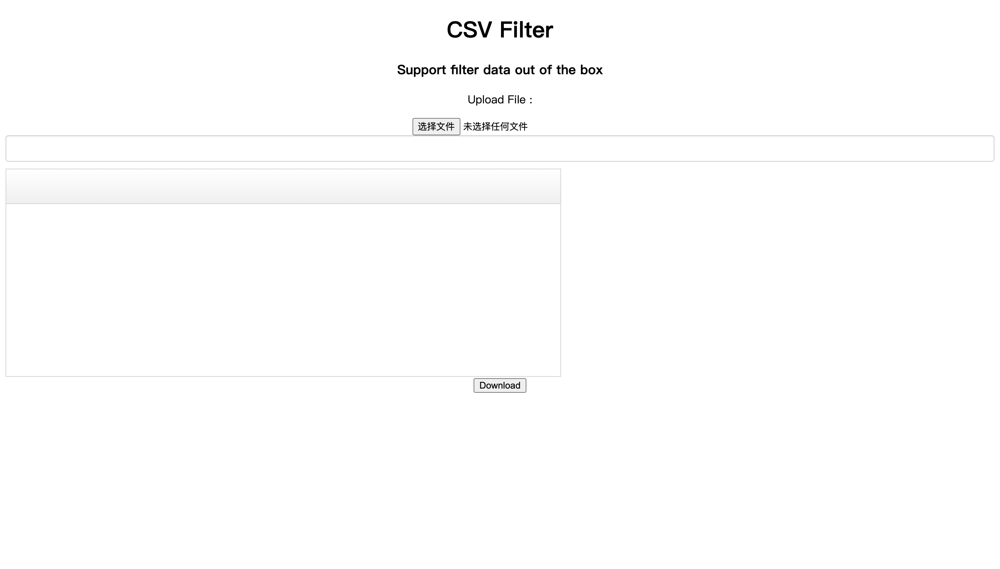
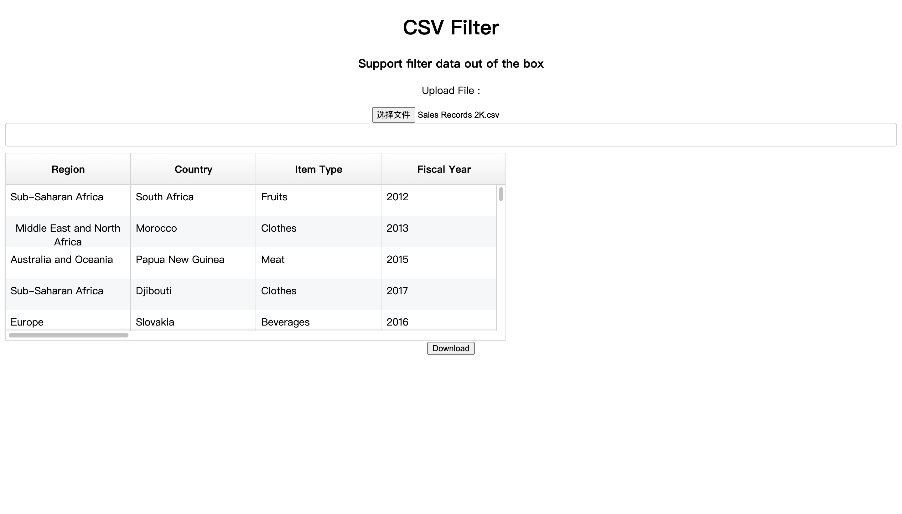
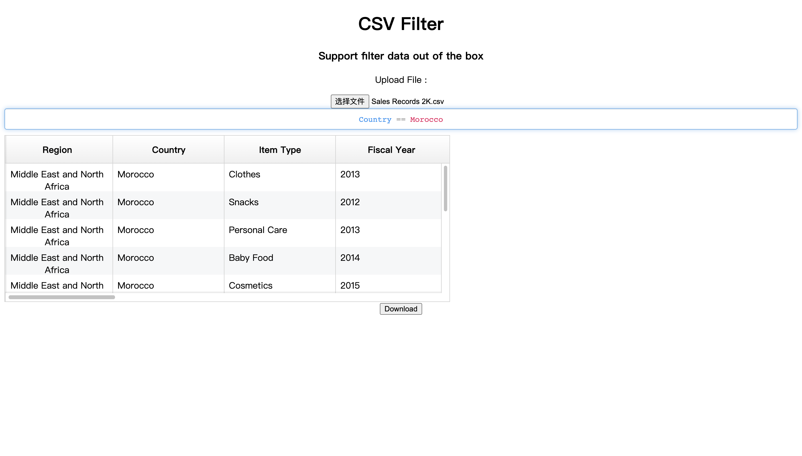
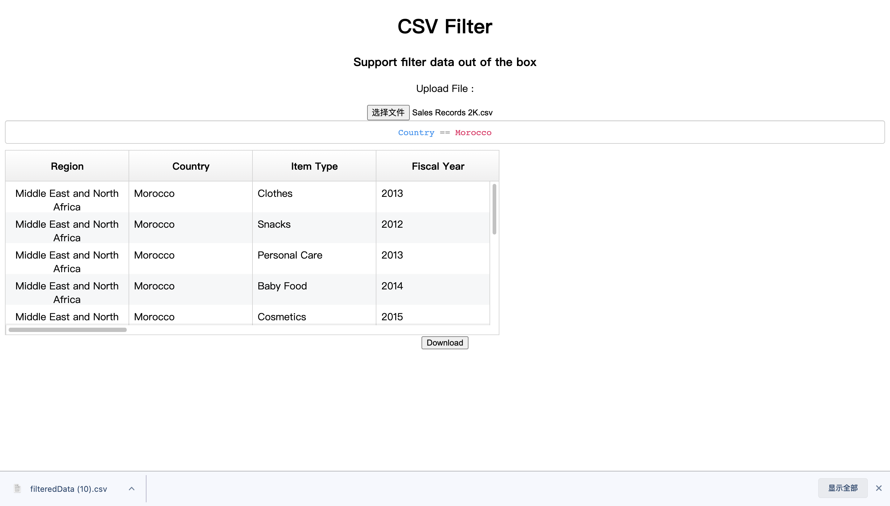
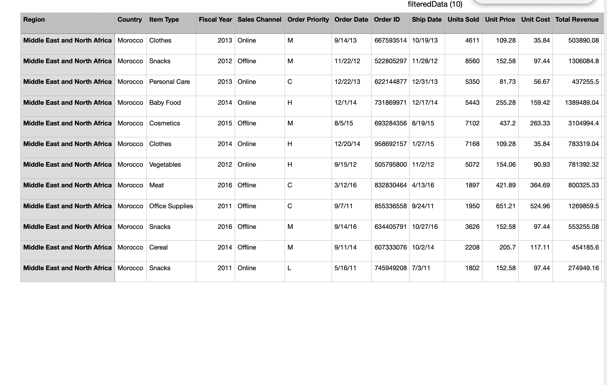

# Getting Started CSV Filter Web App

This project enables CSV upload, CSV filter, and download filtered data functions.

## Available Scripts

In the project directory, you can run:

### `npm start`

Runs the app in the development mode.\
Open [http://localhost:3000](http://localhost:3000) to view it in the browser.

The page will reload if you make edits.\
You will also see any lint errors in the console.

ctrl + c to end sessions.

## Brief Demo with Images

### Init App

### Upload CSV file

### Filter Function

### Export/Download Filtered CSV

